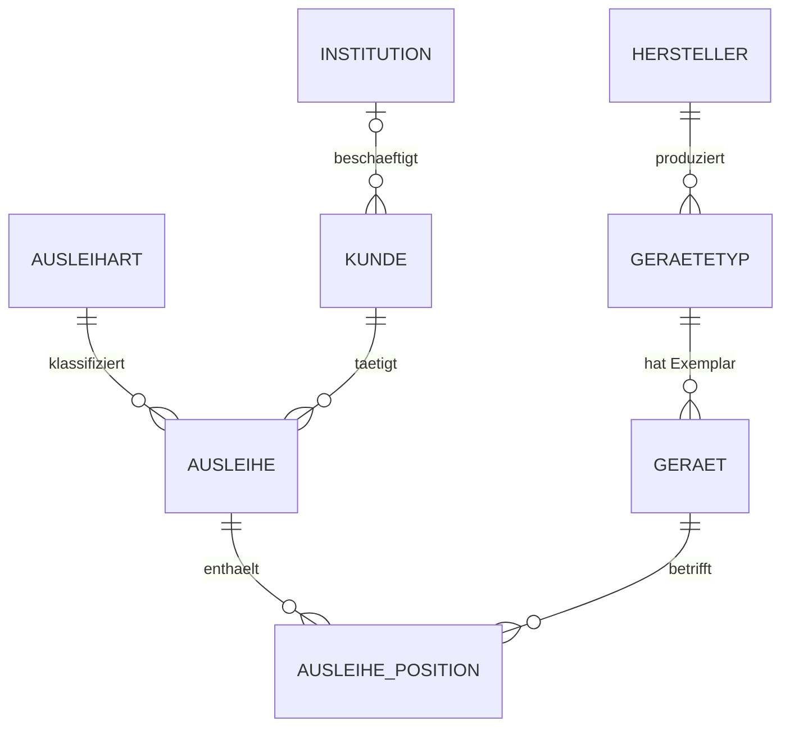

# MediVerleih

Verleihverwaltung für medizintechnische Geräte – Beatmungsgeräte, Infusionspumpen,
Patientenmonitore – an Spitäler, Pflegeheime, Arztpraxen, Rettungsdienste und
Spitex-Organisationen.

Entstanden als **Modularbeit** im Modul Datenbankimplementierung. Der Schwerpunkt
liegt auf der Datenbank, nicht auf der Oberfläche: Die fachlichen Regeln werden von
MariaDB durchgesetzt, nicht von der Applikation.

---

## Datenmodell



8 Tabellen, 3 Views, 3 Trigger, 2 Stored Procedures.

Das Diagramm ist **generiert, nicht gezeichnet**: `deploy/erd-generieren.php` liest
`information_schema` und leitet es aus den vorhandenen Fremdschlüsseln ab. Jede Linie
entspricht einer echten `FOREIGN KEY`-Constraint. Ausführliche Fassung mit Attributen
und Löschregeln in [`docs/erd.md`](docs/erd.md).

---

## Die zwei Regeln, um die es geht

**1. Ein Gerät kann nicht zweimal gleichzeitig verliehen sein.**

```sql
aktiv_geraet_id INT UNSIGNED
    AS (IF(rueckgabe_datum IS NULL, geraet_id, NULL)) PERSISTENT,
CONSTRAINT uq_pos_aktiv UNIQUE (aktiv_geraet_id)
```

Solange eine Ausleihposition offen ist, steht in der berechneten Spalte die Geräte-ID –
ein zweiter offener Eintrag verletzt den UNIQUE-Index. Nach der Rückgabe wird der Wert
NULL, und NULL darf im UNIQUE-Index beliebig oft vorkommen.

**2. Nicht verfügbare Geräte werden abgewiesen.**

```sql
IF v_status <> 'verfuegbar' THEN
    SIGNAL SQLSTATE '45000'
    SET MESSAGE_TEXT = 'Geraet ist nicht verfuegbar (Status pruefen).';
END IF;
```

Damit gibt es zwei Schutzschichten:

| Schicht | Wirkung | umgehbar? |
|---|---|---|
| Trigger `trg_pos_before_insert` | prüft den Status, liefert eine verständliche Meldung | ja – wer den Status von Hand fälscht |
| UNIQUE-Index auf `aktiv_geraet_id` | lässt pro Gerät nur eine offene Position zu | nein – nur durch Schemaänderung |

Der Trigger ist die freundliche Schicht, der Index die harte. Beide greifen auch in
phpMyAdmin und bei jedem direkten SQL-Zugriff – nicht nur in der Webapplikation.

---

## Technik

| | |
|---|---|
| Datenbank | MariaDB 11.8 (InnoDB, utf8mb4) |
| Webserver | Apache 2.4 mit PHP 8.5 |
| Applikation | PHP 8 + PDO, Prepared Statements, kein Framework |
| Verwaltung | phpMyAdmin |
| Betriebssystem | Ubuntu Server 26.04 LTS |

Die Oberfläche kommt ohne Framework und ohne CDN aus – sie funktioniert auch ohne
Internetverbindung.

---

## Installation

Auf einem frischen Ubuntu Server, aus dem Projektverzeichnis heraus:

```bash
sudo bash deploy/install.sh
```

Das Skript installiert MariaDB, Apache, PHP und phpMyAdmin, legt die Datenbank an,
spielt Schema, Logik, Testdaten und Rechte ein, erzeugt zufällige Passwörter und
veröffentlicht die Applikation unter `/var/www/mediverleih`.

Die erzeugten Zugangsdaten landen in `/root/mediverleih-zugangsdaten.txt`
(nur für root lesbar). `web/config.php` wird dabei erzeugt und ist bewusst nicht
versioniert.

### Einzelne Schritte

```bash
sudo mariadb < sql/01_schema.sql
```

```bash
sudo mariadb < sql/02_logik.sql
```

```bash
sudo mariadb < sql/03_testdaten.sql
```

> **`sql/02_logik.sql` nicht über die SQL-Registerkarte in phpMyAdmin einspielen.**
> `DELIMITER` ist eine Anweisung an den Kommandozeilen-Client, kein SQL-Befehl.
> phpMyAdmin schneidet die Prozedurrümpfe am ersten internen Semikolon ab – und da
> `CREATE OR REPLACE` intern erst DROP und dann CREATE ausführt, sind die Routinen
> danach gelöscht statt ersetzt. Hintergrund in
> [`docs/implementierung.md`](docs/implementierung.md), Problem 4.

`sql/04_rechte.sql` enthält Platzhalter für die Passwörter und wird normalerweise nur
über `install.sh` eingespielt.

---

## Aufbau

```
sql/01_schema.sql        Tabellen, Constraints, Indizes
sql/02_logik.sql         Views, Trigger, Stored Procedures
sql/03_testdaten.sql     Beispieldaten, Datumswerte relativ zu CURDATE()
sql/04_rechte.sql        Datenbankbenutzer und Berechtigungen

deploy/install.sh        Setup auf Ubuntu Server
deploy/erd-generieren.php  erzeugt docs/erd.md aus information_schema

docs/konzept.md          Datenmodell, Normalisierungsnachweis, Abgrenzung
docs/implementierung.md  Protokoll der Probleme beim Einspielen + Testprotokoll
docs/erd.md              generiertes ERD
docs/erd.html            druckbare Fassung

web/                     PHP-Applikation (5 Seiten)
```

---

## Rechtekonzept

Drei Datenbankbenutzer, keiner davon `root`:

| Benutzer | Rechte |
|---|---|
| `mediverleih_admin` | alle Rechte auf die Datenbank – Anmeldung in phpMyAdmin |
| `mediverleih_app` | SELECT/INSERT/UPDATE/DELETE + EXECUTE, **kein** CREATE/DROP/ALTER/GRANT |
| `mediverleih_ro` | nur SELECT, und nur auf die drei Views |

Die SQL-Konsole der Applikation verbindet sich als `mediverleih_ro`. Selbst wenn ihre
Eingabeprüfung eine Lücke hätte, fehlen dem Benutzer die Rechte auf die Rohtabellen.

---

## Hinweis

Die Testdaten sind erfunden. Hersteller- und Modellbezeichnungen stammen aus dem
realen Marktumfeld, alle Institutionen, Personen, Adressen und Seriennummern sind
frei erfunden.
