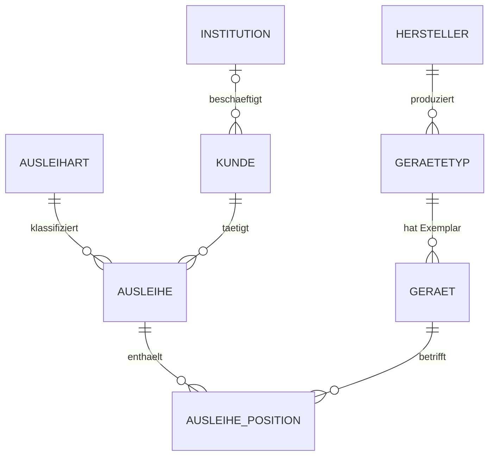
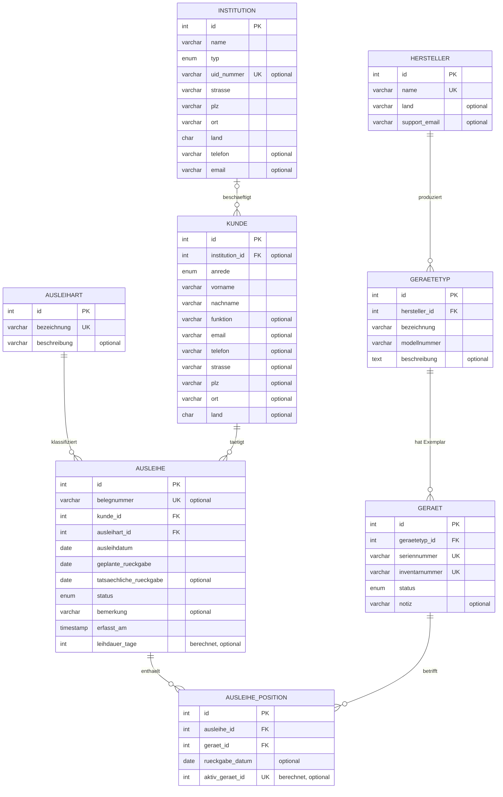

# Entity-Relationship-Diagramm

**Datenbank:** `mediverleih`
**Erzeugt am:** 24.09.2026 16:03

> Dieses Dokument wird von `deploy/erd-generieren.php` aus
> `information_schema` erzeugt. Jede Linie im Diagramm entspricht einer
> tatsächlich vorhandenen `FOREIGN KEY`-Constraint in InnoDB – das
> Diagramm kann deshalb nicht vom Schema abweichen.
>
> Neu erzeugen:
> ```bash
> sudo php deploy/erd-generieren.php > docs/erd.md
> ```

---

## 1. Übersicht

Nur Entitäten und Beziehungen – für Präsentationsfolie und Einstieg.



---

## 2. Mit Attributen

Vollständiges Modell mit Spalten. `PK` = Primärschlüssel, `FK` = Fremdschlüssel, `UK` = eindeutig.



---

## 3. Beziehungen im Detail

| Von | Spalte | Nach | Pflicht | ON DELETE | ON UPDATE |
|---|---|---|---|---|---|
| `ausleihe` | `ausleihart_id` | `ausleihart` | ja | RESTRICT | CASCADE |
| `ausleihe_position` | `ausleihe_id` | `ausleihe` | ja | CASCADE | CASCADE |
| `ausleihe_position` | `geraet_id` | `geraet` | ja | RESTRICT | RESTRICT |
| `geraet` | `geraetetyp_id` | `geraetetyp` | ja | RESTRICT | CASCADE |
| `geraetetyp` | `hersteller_id` | `hersteller` | ja | RESTRICT | CASCADE |
| `kunde` | `institution_id` | `institution` | nein (NULL erlaubt) | RESTRICT | RESTRICT |
| `ausleihe` | `kunde_id` | `kunde` | ja | RESTRICT | CASCADE |


### Was aus dieser Tabelle abzulesen ist

- **`kunde.institution_id` erlaubt NULL** – das ist die technische Umsetzung von
  "Privatperson oder Institution". Im Diagramm erscheint diese Beziehung
  deshalb als *null oder eine* (`|o`) statt *genau eine* (`||`).
- **`ON DELETE RESTRICT`** an fast allen Stellen: Ein Gerät mit Ausleihhistorie
  lässt sich nicht löschen. Die Historie bleibt nachvollziehbar.
- **`ON DELETE CASCADE`** nur bei `ausleihe_position` → `ausleihe`: Positionen
  ohne Beleg wären sinnlos, sie verschwinden mit ihm.
- **Fehlendes `ON UPDATE CASCADE`** bei `kunde.institution_id` und
  `ausleihe_position.geraet_id`: Diese Spalten werden in einem CHECK-Constraint
  bzw. in einer berechneten Spalte verwendet, und MariaDB verbietet dort
  referentielle Aktionen (Fehler 1901, siehe `docs/implementierung.md`).

---

## 4. Kennzahlen

| | |
|---|---|
| Tabellen | 8 |
| Fremdschlüsselbeziehungen | 7 |
