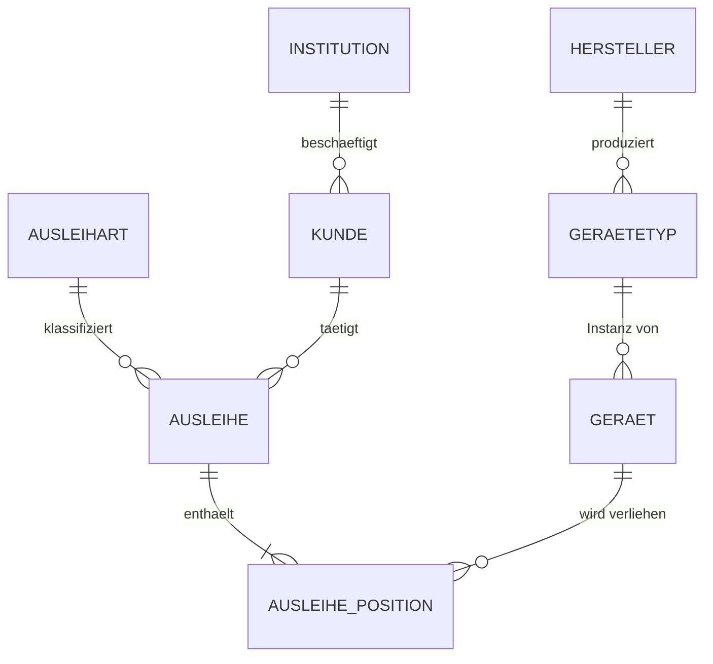

# Modularbeit – Datenbankimplementierung
## "MediVerleih" – Verleih medizintechnischer Geräte

**Umfang: bewusst schlank.** 8 Tabellen, 3 Views, 3 Trigger, 2 Stored Procedures.
Jedes Element hat einen fachlichen Grund und ist in wenigen Sätzen
erklärbar – das ist bei einer Präsentation mehr wert als eine grosse Tabellenzahl.

---

## 1. Projektidee

Ein Dienstleister verleiht **medizintechnische Geräte** – Beatmungsgeräte,
Infusionspumpen, Patientenmonitore, Defibrillatoren – an Spitäler, Pflegeheime,
Arztpraxen, Rettungsdienste und Spitex-Organisationen.

Verwaltet werden:

- **Geräteinventar** – jedes physische Gerät einzeln, mit Hersteller, Typ und Seriennummer
- **Ausleihen** – an welche Institution und welche Person wurde welches Gerät geliefert
- **Leihdauer** – geplante und tatsächliche Rückgabe, Überfälligkeit

---

## 2. Funktionale Anforderungen

| # | Anforderung |
|---|---|
| F1 | Geräte erfassen mit Hersteller, Typ/Modell, Seriennummer (eindeutig), Inventarnummer |
| F2 | Kunden erfassen: Institution **oder** Privatperson, mit Adresse |
| F3 | Ausleihe erfassen: mehrere Geräte pro Beleg, Ausleihdatum + geplante Rückgabe |
| F4 | Leihdauer automatisch berechnen |
| F5 | Rückgabe erfassen, Gerät automatisch wieder freigeben |
| F6 | Ein Gerät kann nie doppelt gleichzeitig verliehen sein – erzwungen durch die DB |
| F7 | Ausgemusterte Geräte können nicht ausgeliehen werden – erzwungen durch die DB |
| F8 | Überfällige Ausleihen erkennen und anzeigen |
| F9 | Ausleihgrund als kontrollierte Liste erfassen, damit er auswertbar ist |

---

## 3. Datenmodell (ERD)



### Die vier Design-Entscheide, die man erklären muss

**1. Typ ≠ Gerät**

```
hersteller (Draegerwerk)
    └── geraetetyp (Beatmungsgeraet Evita V300, Modell EVITAV300)
            ├── geraet  Seriennummer DRG-EV300-2201884
            └── geraet  Seriennummer DRG-EV300-2201907
```

Hersteller, Bezeichnung und Modellnummer stehen **einmal** da. Nur Seriennummer,
Inventarnummer und Status hängen am physischen Stück. Ohne diesen Split müsste
"Draegerwerk" bei jedem Gerät wiederholt werden – eine transitive Abhängigkeit
und damit ein Verstoss gegen die 3. Normalform.

**2. Ausleihe ↔ Gerät ist n:m**

Ein Beleg kann mehrere Geräte enthalten; ein Gerät hat über die Jahre viele Ausleihen.
Aufgelöst über die Zwischentabelle `ausleihe_position`. Sie trägt mit
`rueckgabe_datum` ein eigenes Attribut – der typische Fall einer
Beziehungstabelle mit eigenem Merkmal.

**3. Ein Kundenmodell für zwei Kundenarten**

`kunde.institution_id` darf NULL sein. NULL = Privatperson (z. B. Angehörige in der
Heimpflege), gesetzt = Institution. Statt zwei fast identischer Tabellen gibt es eine,
und ein `CHECK`-Constraint stellt sicher, dass eine Privatperson eine eigene Adresse
hat. Der View `v_kunde` löst die effektive Adresse per `COALESCE` auf.

> *Hinweis zur Benennung:* Die Anforderung sprach von "Firma". Im medizinischen Umfeld
> sind die Kunden Spitäler, Heime und Rettungsdienste – deshalb heisst die Tabelle
> `institution` und hat eine Spalte `typ`. Fachlich ist es dieselbe Entität.

**4. Kontrollierte Liste statt Freitext: `ausleihart`**

Der Grund einer Ausleihe ist eine **Kategorie**, keine Einzelfallbeschreibung:

```
Demostellung                   Erprobung vor einer Beschaffung
Leihgeraet infolge Reparatur   Ersatz, solange das Kundengeraet repariert wird
Leihgeraet infolge Revision    Ersatz waehrend geplanter Wartung
Kapazitaetsengpass             zusaetzlicher Bedarf, z. B. Grossanlass
Langzeitmiete                  laengerfristige Miete ohne eigenes Geraet
```

Jeder dieser Werte trifft auf beliebig viele Belege zu. Als Freitextfeld wäre er
nicht auswertbar – „Reparatur", „reparatur" und „Ersatz wg. Reparatur" ergäben drei
Gruppen. Der Einzelfall steht weiterhin frei in `ausleihe.bemerkung`.

Wichtig für die Fragerunde: **Das ist kein Normalisierungszwang.** `einsatzzweck`
als Freitext hing funktional vom Beleg ab und verletzte keine Normalform. Die
eigene Tabelle ist ein bewusster Modellierungsentscheid zugunsten der
Auswertbarkeit – und genau diese Unterscheidung zu kennen ist der Punkt.

---

## 4. Normalisierung

| Stufe | Nachweis im Modell |
|---|---|
| **1NF** | Keine Mehrfachwerte. Adresse ist in `strasse`, `plz`, `ort`, `land` zerlegt. Mehrere Geräte pro Ausleihe stehen als eigene Zeilen, nicht als Liste in einem Feld. |
| **2NF** | Alle Nicht-Schlüsselattribute hängen vom ganzen Schlüssel ab. `ausleihe_position.rueckgabe_datum` gehört zur Kombination (Beleg, Gerät): Es hängt weder vom Beleg allein ab – auf demselben Beleg können Geräte zu unterschiedlichen Zeitpunkten zurückkommen – noch vom Gerät allein, denn dasselbe Gerät wird über die Jahre mehrfach zurückgegeben. |
| **3NF** | Keine transitiven Abhängigkeiten. Der Hersteller steht nicht bei `geraet`, sondern nur über `geraet → geraetetyp → hersteller`. |

**Bewusst akzeptierte Abweichungen** – gehören so in die Doku, das zeigt Reflexion:

- `plz → ort` ist streng genommen transitiv. Eine eigene PLZ-Tabelle wäre 3NF-reiner,
  bringt hier aber keinen praktischen Nutzen. Bewusst verzichtet.
- `geraet.status` ist aus den Ausleihpositionen ableitbar. Wir speichern ihn trotzdem,
  weil die Geräteliste sonst bei jedem Aufruf über alle Ausleihen joinen müsste.
  Die Redundanz ist ungefährlich, weil **Trigger** den Wert automatisch pflegen –
  auch bei manueller Bearbeitung in phpMyAdmin.

---

## 5. Tabellen

| # | Tabelle | Zweck |
|---|---|---|
| 1 | `hersteller` | Dräger, Philips, B. Braun, … |
| 2 | `geraetetyp` | Modell mit Bezeichnung und Modellnummer |
| 3 | `geraet` | physisches Einzelstück mit **Seriennummer** |
| 4 | `institution` | Spital, Pflegeheim, Arztpraxis, Rettungsdienst, Spitex |
| 5 | `kunde` | Empfänger: Name, Vorname, Funktion, ggf. eigene Adresse |
| 6 | `ausleihart` | kontrollierte Liste der Ausleihgründe |
| 7 | `ausleihe` | Beleg: wer, was für eine Art, ab wann, bis wann |
| 8 | `ausleihe_position` | Beleg ↔ Gerät (n:m) + Rückgabedatum |

Gerätestatus: `verfuegbar` → `verliehen` → `verfuegbar`, dazu `ausgemustert`
für Geräte, die ausser Betrieb genommen wurden.

---

## 6. Logik in der Datenbank

### Generated Columns
- `ausleihe.leihdauer_tage` = `DATEDIFF(geplante_rueckgabe, ausleihdatum)`
  → die Leihdauer wird nie getippt, kann also nie falsch sein.
- `ausleihe_position.aktiv_geraet_id` = `IF(rueckgabe_datum IS NULL, geraet_id, NULL)`

### Die Doppelausleih-Sperre – das Kernstück

Auf `aktiv_geraet_id` liegt ein `UNIQUE`-Index. Solange eine Position offen ist, steht
dort die Geräte-ID – ein zweiter offener Eintrag für dasselbe Gerät verletzt den Index.
Nach der Rückgabe wird der Wert NULL, und NULL darf in einem UNIQUE-Index beliebig oft
vorkommen.

**Ergebnis:** Ein Gerät kann nicht zweimal gleichzeitig verliehen werden – auch dann
nicht, wenn jemand die Applikation umgeht und direkt in phpMyAdmin arbeitet.

Damit gibt es zwei Schutzschichten:

| Schicht | Wirkung | umgehbar? |
|---|---|---|
| Trigger `trg_pos_before_insert` | prüft den Gerätestatus, liefert eine verständliche Meldung | ja, wenn jemand den Status von Hand fälscht |
| UNIQUE-Index auf `aktiv_geraet_id` | lässt pro Gerät nur eine offene Position zu | nein, nur durch Schemaänderung |

Der Trigger ist die freundliche Schicht, der Index die harte.

### Views
| View | Zweck |
|---|---|
| `v_kunde` | Kunde mit effektiver Adresse (Institution oder privat) |
| `v_geraete_uebersicht` | Gerät + Typ + Hersteller in einer Zeile |
| `v_ausleihen_offen` | laufende Ausleihen inkl. Ausleihart und berechneter Verzugstage |

### Trigger
| Trigger | Wirkung |
|---|---|
| `trg_pos_before_insert` | weist Ausleihe ab, wenn das Gerät nicht verfügbar ist (`SIGNAL`) |
| `trg_pos_after_insert` | setzt `geraet.status = 'verliehen'` |
| `trg_pos_after_update` | Rückgabe: Gerät freigeben und Beleg schliessen |

### Stored Procedures
| Routine | Zweck |
|---|---|
| `sp_geraet_ausleihen(...)` | Beleg + Position in **einer Transaktion**, `ROLLBACK` bei Fehler |
| `sp_geraet_zurueckgeben(...)` | Rückgabedatum setzen, den Rest erledigt der Trigger |

### Benutzer & Rechte
- `mediverleih_admin` – Anmeldung in phpMyAdmin
- `mediverleih_app` – SELECT/INSERT/UPDATE/DELETE + EXECUTE, **kein** DROP/ALTER
- `mediverleih_ro` – nur SELECT, und zwar nur auf die Views

Die Webapplikation läuft nicht als `root`.

---

## 7. Was über den Grundstoff hinausgeht (Kriterium 2)

Vier Punkte, die du sicher erklären kannst:

1. **Generated Columns** – berechnete Spalten statt redundanter Erfassung
2. **UNIQUE-Index auf einer berechneten Spalte** als Geschäftsregel in der DB
3. **Trigger mit `SIGNAL`** für automatische Statuspflege und verständliche Fehlermeldungen
4. **Stored Procedure mit Transaktion und `RESIGNAL`**

Verworfen, weil zu erklärungsintensiv für den Zeitrahmen: JSON-Spalten, rekursive CTEs,
Window Functions, Partitionierung, Event Scheduler, Audit-Log, Wartungshistorie.
*(Der Verzicht selbst ist ein Doku-Punkt: begründete Abgrenzung des Umfangs.)*

---

## 8. Technischer Aufbau

```
Ubuntu Server 26.04.1 LTS (Hyper-V-VM lnx-eval01, 192.168.1.107)
├── MariaDB 11.8.6          Datenbank
├── Apache 2.4 + PHP 8.5    Webserver
├── phpMyAdmin              DB-Verwaltung / Demo
└── /var/www/mediverleih    PHP-Applikation
```

Installation als Shell-Skript `deploy/install.sh` – reproduzierbar und zugleich Doku.

---

## 9. PHP-Applikation

PHP 8 + PDO (Prepared Statements) + eigenes Stylesheet. Kein Framework, kein CDN –
die Applikation funktioniert auch ohne Internetverbindung.

| Seite | Inhalt |
|---|---|
| **Dashboard** | Kennzahlen und laufende Ausleihen mit Verzugstagen |
| **Geräte** | Inventar mit Suche und Filter nach Hersteller und Status |
| **Ausleihe erfassen** | Kunde + Gerät + Ausleihart + Leihdauer → ruft `sp_geraet_ausleihen()` |
| **Rückgabe** | Rücknahme laufender Ausleihen, zuletzt abgeschlossene Belege |
| **SQL-Konsole** | Read-only Abfragefeld für die Live-Demo |

Die SQL-Konsole läuft über `mediverleih_ro` und erlaubt nur `SELECT` – damit kannst du
live Abfragen zeigen, ohne nach phpMyAdmin zu wechseln.

---

## 10. Zeitbudget (6–8 h)

| Schritt | Aufwand |
|---|---|
| Konzept und Modell verstehen, ERD selbst nachzeichnen | 1.0 h |
| Server aufsetzen (Skript ausführen, verstehen) | 1.0 h |
| SQL durchgehen, anpassen, mit eigenen Daten testen | 1.5 h |
| PHP-Applikation anschauen und anpassen | 1.0 h |
| Dokumentation schreiben | 2.0 h |
| Präsentation aufbauen und einmal durchspielen | 1.5 h |
| **Total** | **8.0 h** |

---

## 11. Abdeckung des Bewertungsrasters

| Kriterium | Abdeckung |
|---|---|
| **1 – Komplexität/Umfang** | 8 Tabellen, n:m-Auflösung, 3 Views, 3 Trigger, 2 Procedures, Rechtekonzept |
| **2 – Vertiefung/neuer Stoff** | Normalisierung mit begründeten Abweichungen, Generated Columns, Trigger mit SIGNAL, Transaktionen |
| **3 – Produkt** | Lauffähige PHP-App auf echtem Server, Integrität in der DB erzwungen |
| **4 – Dokumentation** | Konzept, ERD, Normalisierungsnachweis, Installationsanleitung, Implementierungsprotokoll mit Testfällen |
| **5 – Präsentation** | Vier Live-Demos, siehe unten |

### Die vier Demo-Momente

1. Gerät ausleihen → Status springt automatisch auf `verliehen`
2. Dasselbe Gerät nochmals ausleihen → Datenbank weist es ab
3. Ausgemustertes Gerät **MP-0017** ausleihen → Datenbank weist es ab
4. Gerätestatus in phpMyAdmin von Hand auf `verfuegbar` fälschen, dann direkt in
   `ausleihe_position` einfügen → der UNIQUE-Index weist es trotzdem ab

Demo 4 ist die stärkste: Sie zeigt, dass die Regel nicht in der Oberfläche und auch
nicht nur im Trigger steckt, sondern in der Struktur der Datenbank selbst.

---

## 12. Dateien

```
sql/01_schema.sql       Tabellen, Constraints, Indizes
sql/02_logik.sql        Views, Funktion, Trigger, Procedures
sql/03_testdaten.sql    Beispieldaten (18 Geraete, 5 Institutionen, 6 Ausleihen)
                        vor einer Demo erneut einspielen - Datumswerte sind relativ
sql/04_rechte.sql       Benutzer und Berechtigungen
deploy/install.sh       Ubuntu-Setup (MariaDB, Apache, PHP, phpMyAdmin)
docs/implementierung.md Protokoll der Probleme beim Einspielen + Testprotokoll
web/style.css           Stylesheet, ohne Framework und ohne CDN
web/db.php              PDO-Verbindungen (Schreib- und Nur-Lese-Benutzer)
web/layout.php          Seitengeruest, Ausgabe-Escaping
web/index.php           Dashboard
web/geraete.php         Geraeteinventar mit Filter
web/ausleihe.php        Ausleihe erfassen
web/rueckgabe.php       Rueckgabe
web/sql.php             SQL-Konsole (nur lesend)
```
